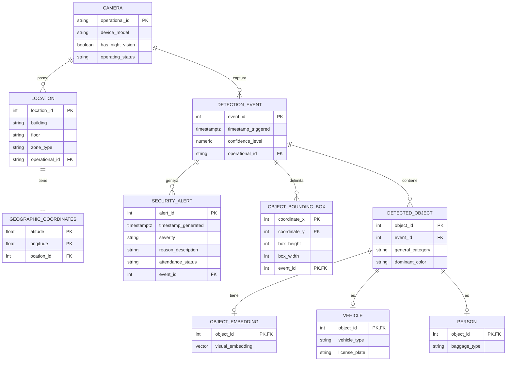

# INFORME DE DISEÑO Y CONSULTAS ANALÍTICAS DE BASE DE DATOS
## Laboratorio de Monitoreo de Seguridad por Visión Artificial 
---

## 1. Introducción y Contexto del Problema

El objetivo de este laboratorio es diseñar e implementar la estructura de una base de datos relacional para un sistema real de monitoreo de seguridad física basado en visión artificial. El sistema captura eventos en tiempo real mediante cámaras de seguridad distribuidas en diferentes zonas físicas y procesa las imágenes para detectar objetos (personas y vehículos), generar alertas de seguridad en caso de intrusiones en zonas restringidas, y extraer embeddings vectoriales de alta dimensión para realizar análisis de similitud visual (re-identificación).

El reto de esta fase consiste en traducir un conjunto de datos crudos (provistos en formato CSV) a un modelo completamente normalizado en PostgreSQL, desarrollando un script DDL (`schema.sql`), un script de poblado dinámico (`seed.sql`), y resolviendo un conjunto de consultas analíticas avanzadas que incluyen cálculos temporales y búsquedas por similitud vectorial con la extensión `pgvector`.

---

## 2. Diagrama Entidad-Relación

Para visualizar la estructura lógica de la base de datos y cómo interactúan las diferentes tablas del esquema `monitoring`, se presenta el siguiente diagrama Entidad-Relación utilizando la notación de Mermaid:



---

## 3. Justificación de las Decisiones de Diseño

Para modelar este sistema, decidimos implementar un esquema estructurado en el esquema lógico `monitoring`, asegurando la integridad referencial y minimizando la redundancia de datos.

### 3.1. Estrategia de Herencia (Superclase/Subclase) para Objetos Detectados
El problema requiere almacenar objetos detectados de tipo **Persona** y **Vehículo**. Cada uno de ellos comparte ciertos atributos básicos (como el identificador único del objeto, el evento al que pertenece y el color dominante) pero tienen propiedades exclusivas (el tipo de carrocería en vehículos y el tipo de equipaje o equipaje de mano en personas).

Decidimos aplicar el patrón **Table-per-Subclass (Herencia de Tabla Unificada o Joined Table Inheritance)** mediante tres tablas físicas:
1. `monitoring.detected_object` (Superclase): Contiene las columnas compartidas `object_id`, `event_id`, `general_category` (con un CHECK para restringir a `'VEHICLE'` o `'PERSON'`) y `dominant_color`.
2. `monitoring.vehicle` (Subclase): Mantiene como llave primaria y foránea `object_id` referenciando a la superclase, junto con `vehicle_type` y `license_plate`.
3. `monitoring.person` (Subclase): Mantiene como llave primaria y foránea `object_id` referenciando a la superclase, junto con el atributo exclusivo `baggage_type`.

**Justificación:** Esta estrategia evita almacenar una gran cantidad de valores nulos (lo que ocurriría en una sola tabla unificada Table-per-Hierarchy) y mantiene una normalización de Tercera Forma Normal (3FN), garantizando que las consultas especializadas sobre personas o vehículos no requieran recorrer datos irrelevantes de la otra subclase.

### 3.2. Diseño Satélite 1:1 para Embeddings Vectoriales
Los embeddings vectoriales extraídos por el modelo de IA tienen una dimensión de 512. En el archivo de origen (CSV), no todos los objetos detectados poseen embedding (por ejemplo, cuando la confianza de detección es menor a un umbral determinado).
Para evitar poblar la superclase `detected_object` con arreglos nulos o desperdiciar almacenamiento, creamos una tabla satélite separada `monitoring.object_embedding`.

**Justificación:** La relación 1:1 opcional entre `detected_object` y `object_embedding` garantiza que solo se asigne espacio para el vector de 512 dimensiones cuando el embedding esté disponible, optimizando el rendimiento de los índices y el almacenamiento en disco de la tabla principal.

### 3.3. Tipos de Datos Seleccionados
- **`TIMESTAMPTZ`:** Usado en las marcas de tiempo (`timestamp_triggered` en eventos y `timestamp_generated` en alertas) para asegurar que el huso horario se preserve globalmente y evitar conflictos si los servidores de base de datos e inferencia operan en zonas horarias distintas.
- **`NUMERIC(5,4)`:** Seleccionado para `confidence_level` en lugar de `REAL` o `FLOAT`. Esto limita la precisión a 4 decimales exactos y evita los típicos problemas de redondeo y aritmética imprecisa de punto flotante en consultas de filtro (ej: buscar confianza mayor a `0.70`).
- **`vector(512)`:** Formato específico proporcionado por la extensión `pgvector` de PostgreSQL. Es ideal para representar huellas visuales neuronales y permite utilizar índices espaciales de alto rendimiento (como HNSW e IVFFlat) y operadores matemáticos dedicados de distancia.
- **`VARCHAR(55)`** y **`VARCHAR(255)`**: Usados en códigos alfa-numéricos institucionales (`operational_id` de las cámaras) y textos descriptivos, controlando el límite de longitud para evitar abusos en el consumo de memoria.

### 3.4. Restricciones y Reglas de Integridad (CHECK y ON DELETE)
- **Restricciones CHECK:** Implementamos validaciones estrictas como:
  - `chk_operating_status` en la tabla `camera` (`'active'`, `'inactive'`, `'maintenance'`, `'fault'`).
  - `chk_severity` en `security_alert` (`'low'`, `'medium'`, `'high'`, `'critical'`).
  - `chk_confidence_level` en `detection_event` para forzar que el valor numérico esté estrictamente entre `0.0000` y `1.0000`.
- **Integridad Referencial (`ON DELETE CASCADE`):** Definido en todas las llaves foráneas. Si un evento de detección es eliminado del sistema, todas sus cajas delimitadoras (`object_bounding_box`), alertas asociadas (`security_alert`) y objetos detectados (`detected_object`) se eliminan en cascada de manera automática, manteniendo la base de datos limpia de registros huérfanos.

---

## 4. Lógica de Poblado (Mapeo de Datos)

En la Fase 2B, escribimos el script `generate_seeder.py` para procesar las 100 filas del archivo `seed_100.csv` y transformarlas en instrucciones `INSERT INTO` en PostgreSQL (`seed.sql`). Encontramos discrepancias lógicas entre los datos crudos y las restricciones del esquema relacional, por lo que aplicamos la siguiente lógica de mapeo:

1. **Estado de Cámara (`camara_estado`):** El CSV contiene valores en español como `'activa'`. Estos fueron normalizados a `'active'` para cumplir con la restricción `chk_operating_status` de la tabla `camera`.
2. **Severidad de Alertas (`alerta_severidad`):** Se mapeó el valor `'alta'` a `'high'` para coincidir con la restricción CHECK de severidades en inglés (`'low'`, `'medium'`, `'high'`, `'critical'`).
3. **Estado de Alertas (`alerta_estado`):** Los valores en español como `'pendiente'` y `'atendida'` fueron mapeados respectivamente a `'unattended'` y `'resolved'`.
4. **Deduplicación de Alertas:** En el archivo CSV, múltiples filas comparten el mismo `evento_id` (porque un solo evento/frame puede contener más de un objeto detectado), repitiendo la información de la alerta en esas filas. Para evitar violaciones de clave primaria, el script rastrea las alertas procesadas por `evento_id` y solo inserta un único registro en la tabla `security_alert` para cada evento único, asignándoles IDs secuenciales automáticos.
5. **Formateo de Vectores:** Los vectores de embeddings en el CSV se leen como cadenas de texto en formato JSON/arreglo (ej: `[0.0224, -0.0062, ...]`). El script los envuelve en comillas simples para que PostgreSQL los interprete como literales de tipo vector.

---

## 5. Explicación y Justificación de las Consultas Analíticas

A continuación, se detalla la lógica de resolución para cada una de las consultas:

### Consulta 1: Cámaras con mayor número total de detecciones en los últimos 30 días
**Objetivo:** Obtener las 3 cámaras con más actividad reciente.
```sql
SELECT 
    operational_id AS camara_id, 
    COUNT(*) AS total_detecciones
FROM 
    monitoring.detection_event
WHERE 
    timestamp_triggered >= CURRENT_TIMESTAMP - INTERVAL '30 days'
GROUP BY 
    operational_id
ORDER BY 
    total_detecciones DESC
LIMIT 3;
```
* **Explicación:** Filtramos los eventos de detección ocurridos en los últimos 30 días restando un intervalo de tiempo al timestamp actual (`CURRENT_TIMESTAMP`). Agrupamos las filas por el identificador de la cámara (`operational_id`), contamos el total de registros por grupo, los ordenamos de mayor a menor y limitamos la salida a los 3 registros más altos.

---

### Consulta 2: Vehículos detectados por tipo en zonas restringidas, agrupados por día de la semana
**Objetivo:** Analizar intrusiones vehiculares en pasos peatonales restringidos según el día de la semana.
```sql
SELECT 
    v.vehicle_type AS tipo_vehiculo,
    EXTRACT(ISODOW FROM de.timestamp_triggered) AS dia_semana_numero,
    TO_CHAR(de.timestamp_triggered, 'FMDay') AS dia_semana_nombre,
    COUNT(*) AS cantidad_vehiculos
FROM 
    monitoring.vehicle v
JOIN 
    monitoring.detected_object dobj ON v.object_id = dobj.object_id
JOIN 
    monitoring.detection_event de ON dobj.event_id = de.event_id
JOIN 
    monitoring.location l ON de.operational_id = l.operational_id
WHERE 
    l.zone_type = 'peatonal_restringida'
GROUP BY 
    v.vehicle_type,
    EXTRACT(ISODOW FROM de.timestamp_triggered),
    TO_CHAR(de.timestamp_triggered, 'FMDay')
ORDER BY 
    dia_semana_numero, 
    cantidad_vehiculos DESC;
```
* **Explicación:** Unimos las tablas necesarias para conectar el tipo de vehículo (`vehicle`) con la zona donde ocurrió (`location`). Filtramos solo las ubicaciones con `zone_type = 'peatonal_restringida'`. Para agrupar temporalmente por día de la semana, usamos `EXTRACT(ISODOW ...)` (que retorna de 1 a 7, garantizando que el orden sea cronológico de Lunes a Domingo) y `TO_CHAR(..., 'FMDay')` para mostrar el nombre del día de la semana sin espacios en blanco adicionales.

---

### Consulta 3: Promedio de confianza del modelo por cámara (Eventos con confianza > 0.70)
**Objetivo:** Medir la certeza promedio del sistema de visión artificial en detecciones de alta calidad.
```sql
SELECT 
    operational_id AS camara_id,
    ROUND(AVG(confidence_level), 4) AS promedio_confianza
FROM 
    monitoring.detection_event
WHERE 
    confidence_level > 0.7000
GROUP BY 
    operational_id
ORDER BY 
    promedio_confianza DESC;
```
* **Explicación:** Filtramos los registros de la tabla `detection_event` donde el nivel de confianza supera el umbral de `0.70`. Luego, agrupamos por cámara (`operational_id`) y calculamos el valor medio de confianza con `AVG(confidence_level)`, formateando a 4 decimales con `ROUND` para mantener uniformidad con el diseño del tipo de dato `NUMERIC(5,4)`.

---

### Consulta 4: Cámaras inactivas o sin registros en los últimos 7 días
**Objetivo:** Identificar dispositivos desconectados o que no han reportado datos en la última semana.
```sql
SELECT 
    c.operational_id AS camara_id,
    c.device_model AS modelo_dispositivo,
    c.operating_status AS estado_operativo
FROM 
    monitoring.camera c
WHERE NOT EXISTS (
    SELECT 1 
    FROM monitoring.detection_event de
    WHERE de.operational_id = c.operational_id
      AND de.timestamp_triggered >= CURRENT_TIMESTAMP - INTERVAL '7 days'
)
ORDER BY 
    c.operational_id;
```
* **Explicación:** Seleccionamos todas las cámaras registradas en la tabla `camera` y aplicamos un filtro con la cláusula `NOT EXISTS`. La subconsulta busca si existe algún evento de detección asociado a la cámara en el rango de los últimos 7 días. Si no se encuentra ninguno, la cámara califica como inactiva y se incluye en el resultado. Esta técnica es más eficiente que un `LEFT JOIN` con exclusión de nulos.

---

### Consulta 5: Alertas generadas por cámara en el último mes, agrupadas por severidad
**Objetivo:** Obtener un resumen de la cantidad y gravedad de incidentes de seguridad reportados.
```sql
SELECT 
    de.operational_id AS camara_id,
    sa.severity AS severidad,
    COUNT(*) AS cantidad_alertas
FROM 
    monitoring.security_alert sa
JOIN 
    monitoring.detection_event de ON sa.event_id = de.event_id
WHERE 
    sa.timestamp_generated >= CURRENT_TIMESTAMP - INTERVAL '1 month'
GROUP BY 
    de.operational_id,
    sa.severity
ORDER BY 
    de.operational_id,
    cantidad_alertas DESC;
```
* **Explicación:** Unimos las tablas `security_alert` y `detection_event` mediante `event_id` para identificar de qué cámara provino la detección que provocó la alerta. Filtramos por la fecha de generación de la alerta (`timestamp_generated`) dentro del último mes y agrupamos por el identificador de cámara y el nivel de severidad.

---

### Consulta 6: Las 5 huellas digitales (embeddings) más similares al primer objeto del CSV
**Objetivo:** Buscar similitud visual comparando contra el primer objeto detectado en el dataset.
```sql
SELECT 
    object_id,
    visual_embedding <=> (
        SELECT visual_embedding 
        FROM monitoring.object_embedding 
        WHERE object_id = 1
    ) AS distancia_coseno
FROM 
    monitoring.object_embedding
WHERE 
    object_id != 1
ORDER BY 
    distancia_coseno ASC
LIMIT 5;
```
* **Explicación:** Obtenemos el vector de características del primer objeto insertado (que tiene el ID `1`) mediante una subconsulta. Usamos el operador de distancia coseno (`<=>`) provisto por la extensión `pgvector` para medir la distancia angular entre los vectores guardados. Filtramos para no comparar el objeto con sí mismo (`object_id != 1`), ordenamos de menor a mayor distancia coseno (donde menor distancia significa mayor similitud) y limitamos a las 5 coincidencias más cercanas.

---

### Consulta 7: Buscar objetos en las últimas 24 horas parecidos a un embedding de referencia (distancia coseno < 0.15)
**Objetivo:** Búsqueda rápida de objetos similares en tiempo real a una imagen patrón en las últimas 24 horas.
```sql
SELECT 
    oe.object_id,
    dobj.general_category AS categoria_objeto,
    de.timestamp_triggered AS marca_tiempo,
    (oe.visual_embedding <=> :embedding_referencia::vector) AS distancia_coseno
FROM 
    monitoring.object_embedding oe
JOIN 
    monitoring.detected_object dobj ON oe.object_id = dobj.object_id
JOIN 
    monitoring.detection_event de ON dobj.event_id = de.event_id
WHERE 
    de.timestamp_triggered >= CURRENT_TIMESTAMP - INTERVAL '24 hours'
    AND (oe.visual_embedding <=> :embedding_referencia::vector) < 0.15
ORDER BY 
    distancia_coseno ASC;
```
* **Explicación:** Esta consulta une `object_embedding`, `detected_object` y `detection_event` para poder filtrar por rango temporal (`timestamp_triggered` en las últimas 24 horas). Calculamos la distancia coseno respecto a un parámetro dinámico (`:embedding_referencia`), aplicando un filtro para conservar únicamente aquellos registros cuya distancia sea estrictamente menor a `0.15` (umbral de coincidencia visual alta). Finalmente, ordenamos los resultados de menor distancia (más parecidos) a mayor.

---

## 6. Conclusión

El diseño planteado asegura el cumplimiento estricto de las reglas de normalización de bases de datos, permitiendo almacenar eficientemente información heterogénea y de alta densidad como coordenadas geográficas, estados de alertas y vectores de visión de 512 dimensiones. La correcta definición de tipos de datos (`TIMESTAMPTZ`, `NUMERIC(5,4)`) y restricciones de chequeo protege al sistema contra la entrada de inconsistencias operativas comunes en entornos reales de producción. Las consultas analíticas implementadas demuestran el potencial del motor relacional para consolidar reportes operativos de seguridad en tiempo real y realizar búsquedas de similitud vectorial avanzadas.
